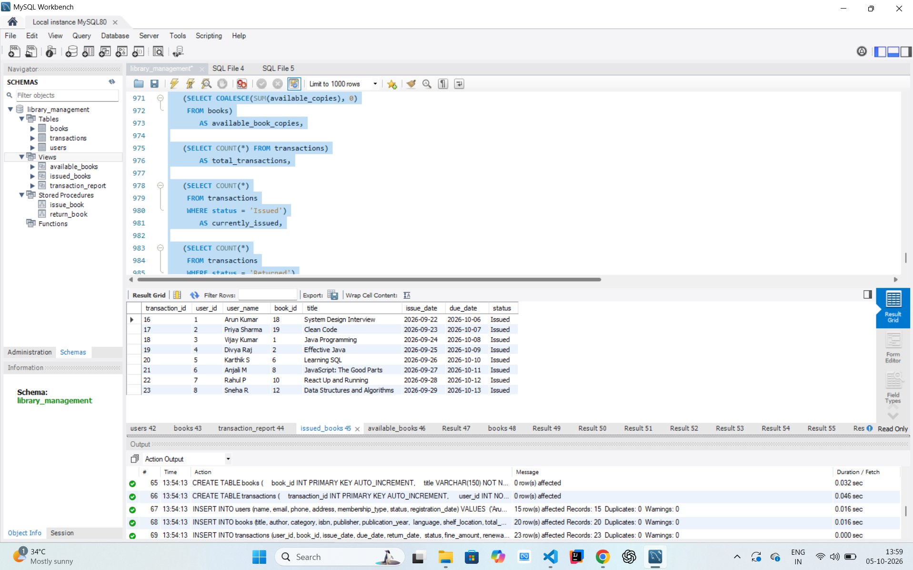
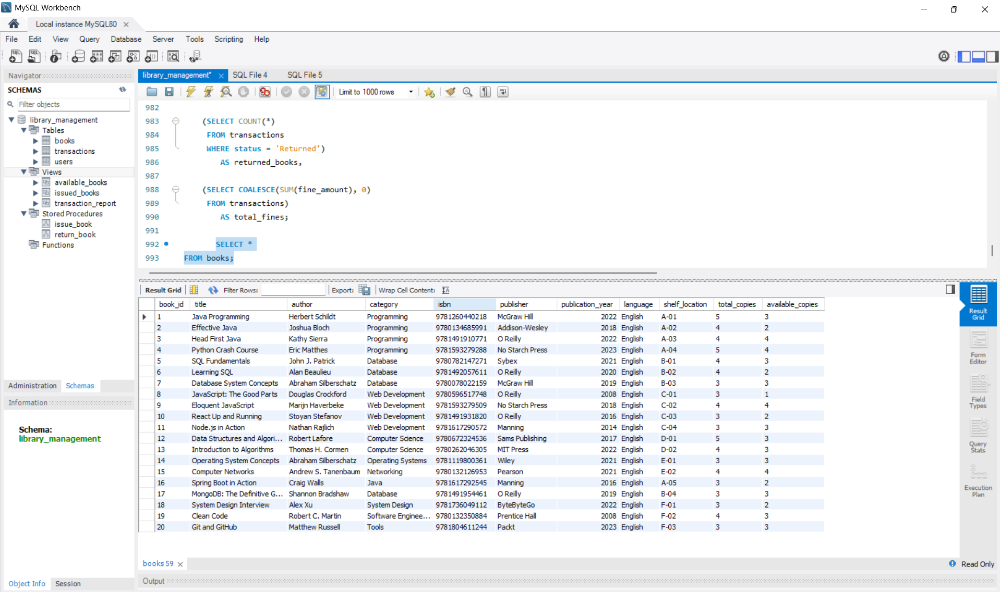
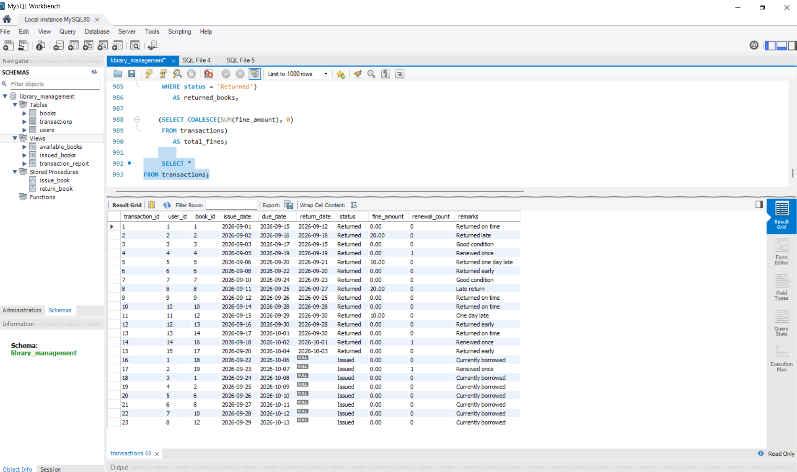
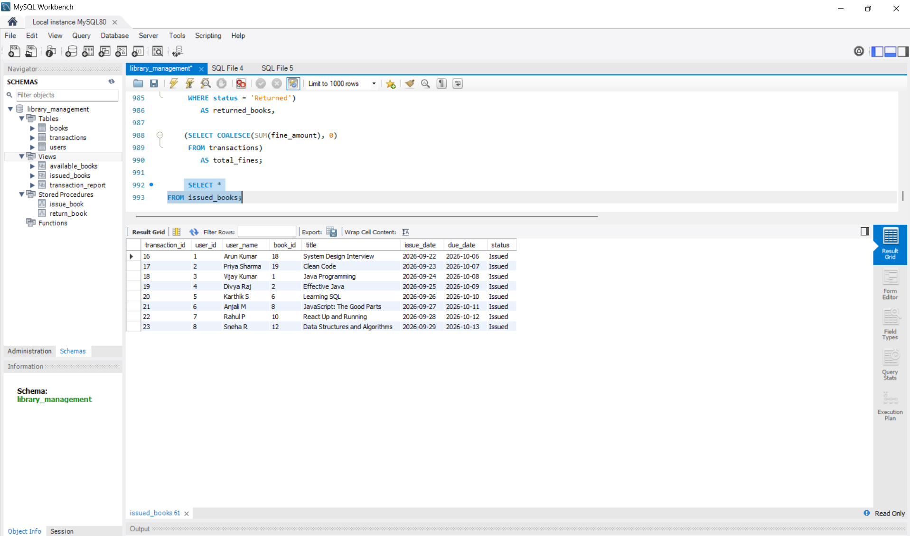
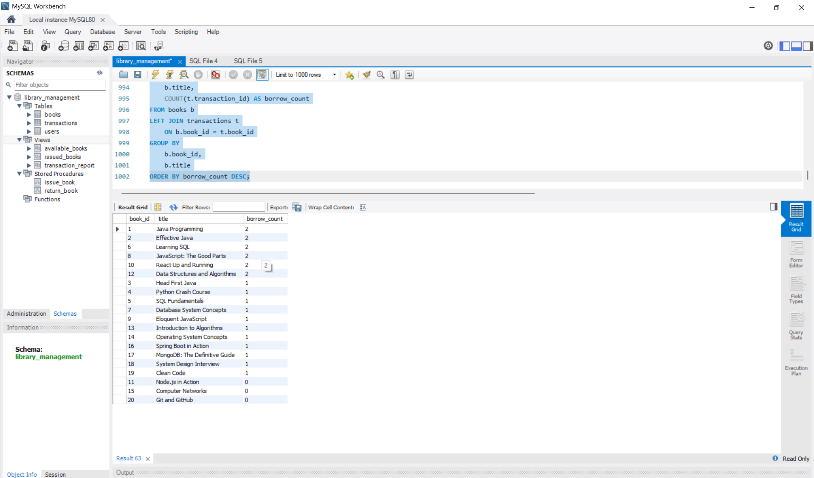
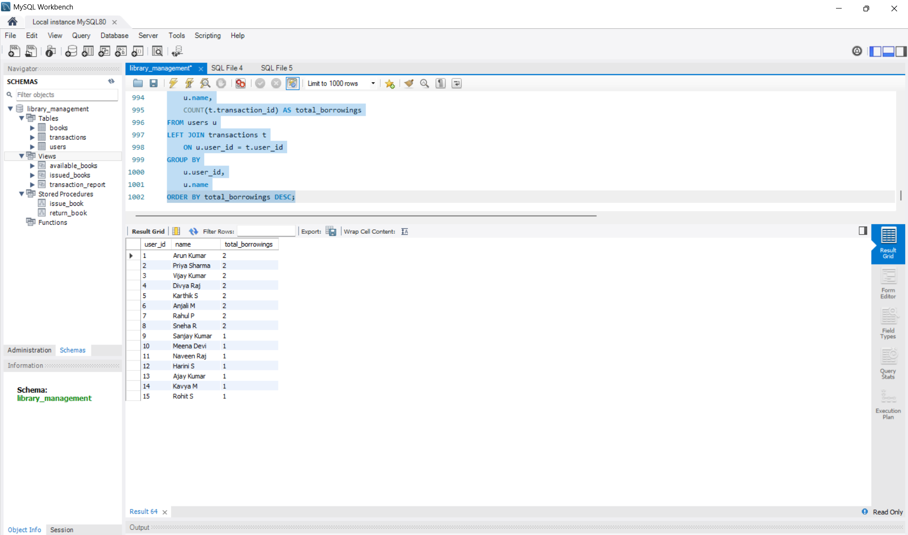

# Library Management Database System

## 📌 Project Overview

A relational database system developed using **MySQL** to manage library users, books, book availability, and borrowing transactions.

The system provides functionality for managing users and books, issuing and returning books, tracking transactions, calculating overdue fines, and generating library reports.

---

## 🛠️ Technologies Used

- MySQL
- SQL
- MySQL Workbench

---

## ⚙️ Features

- User management
- Book management
- Book availability tracking
- Book issuing
- Book returning
- Transaction tracking
- Overdue fine calculation
- Borrowing history
- Library reports
- Stored procedures
- Database views
- Data validation and constraints

---

## 🗄️ Database Tables

### 1. Users

The `users` table stores library member information.

It includes:

- User ID
- Name
- Email
- Phone
- Address
- Membership Type
- Status
- Registration Date

### 2. Books

The `books` table stores information about books available in the library.

It includes:

- Book ID
- Title
- Author
- Category
- ISBN
- Publisher
- Publication Year
- Language
- Shelf Location
- Total Copies
- Available Copies

### 3. Transactions

The `transactions` table stores information about book issuing and returning.

It includes:

- Transaction ID
- User ID
- Book ID
- Issue Date
- Due Date
- Return Date
- Status
- Fine Amount
- Renewal Count
- Remarks

---

## 🔗 Database Relationships

The `transactions` table connects the `users` and `books` tables.

- One user can have multiple transactions.
- One book can have multiple transactions.
- `user_id` in `transactions` references `user_id` in `users`.
- `book_id` in `transactions` references `book_id` in `books`.

### Relationship Structure

```text
Users
  |
  | 1
  |
  | M
Transactions
  |
  | M
  |
  | 1
Books
```

---

## 📦 Stored Procedures

The project contains two stored procedures.

### `issue_book`

Used to issue a book to a user.

The procedure checks:

- Whether the user exists
- Whether the user is active
- Whether the book exists
- Whether copies are available
- Whether the user already has the same book issued

It then creates a transaction and decreases the available book copies.

### `return_book`

Used to return an issued book.

The procedure:

- Checks the transaction
- Updates the return date
- Changes the transaction status
- Calculates the overdue fine
- Increases the available book copies
- Stores return information

---

## 👁️ Database Views

The project contains the following views:

### `available_books`

Displays books that currently have available copies.

### `issued_books`

Displays books that are currently issued to users.

### `transaction_report`

Displays combined information about users, books, and transactions.

---

## 💰 Fine Management

The system calculates overdue fines when a book is returned after its due date.

The fine rate used in the project is:

```text
₹10 per overdue day
```

---

## 🔐 Database Constraints

The project uses SQL constraints to maintain data integrity.

- Primary Key
- Foreign Key
- NOT NULL
- UNIQUE
- DEFAULT
- CHECK
- ENUM
- AUTO_INCREMENT

These constraints help ensure that valid and consistent data is stored in the database.

---

## 📊 Reports and SQL Queries

The project includes queries for:

- Viewing all users
- Viewing all books
- Viewing all transactions
- Viewing issued books
- Viewing available books
- Finding overdue books
- Finding books with low availability
- Finding most borrowed books
- Finding most active users
- Category-wise book statistics
- Finding users currently holding books
- Finding users who never borrowed a book
- Finding books that have never been borrowed
- Calculating total fines
- Membership statistics
- Database summary

---

## 🧪 Testing

The database was tested using SQL queries, JOIN operations, stored procedures, and database views.

The following operations were tested:

- User data
- Book data
- Transaction data
- Book availability
- Book issuing
- Book returning
- Fine calculation
- JOIN operations
- Database views
- Library reports

Example queries:

```sql
SELECT * FROM users;

SELECT * FROM books;

SELECT * FROM transactions;

SELECT * FROM available_books;

SELECT * FROM issued_books;

SELECT * FROM transaction_report;
```

---

## 🚀 How to Run

### Step 1: Install MySQL

Install:

- MySQL Server
- MySQL Workbench

### Step 2: Open the SQL File

Open the following file in MySQL Workbench:

```text
library_management.sql
```

### Step 3: Execute the SQL Script

Execute the complete SQL script using the **Execute** button in MySQL Workbench.

### Step 4: Refresh the Database

Refresh the **Schemas** section.

The database will appear as:

```text
library_management
```

### Step 5: Explore the Database

The database contains:

```text
library_management
│
├── Tables
│   ├── books
│   ├── transactions
│   └── users
│
├── Views
│   ├── available_books
│   ├── issued_books
│   └── transaction_report
│
└── Stored Procedures
    ├── issue_book
    └── return_book
```

---

## 📸 Project Screenshots

### Database Structure



### Users Table


### Books Table



### Transactions Table



### Issued Books



### Transaction Report



### Reports



---

## 📁 Project Structure

```text
Library-Management-Database-System/
│
├── library_management.sql
├── README.md
│
└── screenshots/
    ├── database_tables.png
    ├── users_table.png
    ├── books_table.png
    ├── transactions_table.png
    ├── issued_books.png
    ├── transaction_report.png
    └── reports.png
```

---

## 🎯 Project Objective

The objective of this project is to demonstrate practical knowledge of:

- Relational database design
- SQL
- MySQL
- Primary keys
- Foreign keys
- Database relationships
- Constraints
- JOIN operations
- Stored procedures
- Views
- Transactions
- Data validation
- Reporting queries

---

## 📚 SQL Concepts Demonstrated

This project demonstrates the practical use of:

```text
CREATE DATABASE
CREATE TABLE
PRIMARY KEY
FOREIGN KEY
NOT NULL
UNIQUE
DEFAULT
CHECK
ENUM
AUTO_INCREMENT
INSERT
SELECT
UPDATE
DELETE
JOIN
GROUP BY
ORDER BY
COUNT
SUM
CASE
VIEWS
STORED PROCEDURES
TRANSACTIONS
```

---

## 👨‍💻 Author

**Ashwin**

B.Sc. Physics

2022 Graduate

---

## ⭐ Project Status

**Completed**

The Library Management Database System includes database design, sample data, relationships, stored procedures, views, transaction management, fine calculation, reporting queries, screenshots, and testing.
